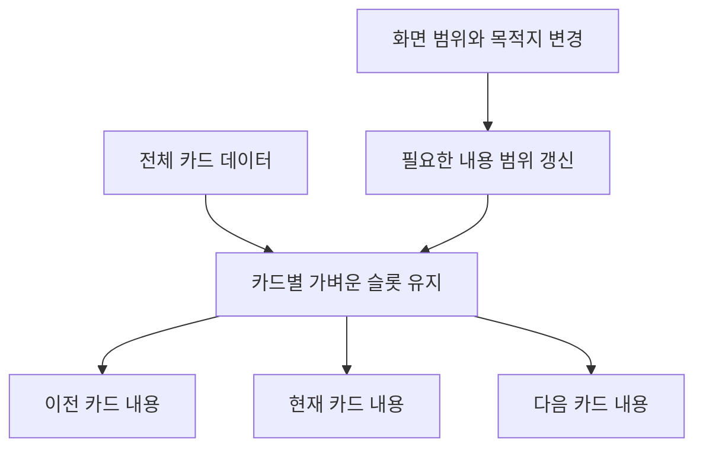

# 가로 카드 UI와 렌더링 최적화 가이드

<!-- INTENT: 카드 한 장에 집중하는 화면과 화면 밖 이웃 카드의 연속성을 함께 유지한다. 위치를 보존하는 슬롯과 비용이 큰 카드 내용을 분리하고, 정지 중의 세 장 구성을 이동 중에도 강제해서 빈 카드나 상태 손실을 만드는 일을 막는다. 다른 앱에서도 배치, 렌더링 범위와 상태 수명을 함께 설계하도록 한다. -->

가로 카드 화면은 **정지했을 때 한 장에 집중하고, 움직일 때 이웃 카드가 함께 들어오는 구조**로 만듭니다. 렌더링 비용은 현재 카드와 양옆 카드의 내용을 준비하는 방식으로 줄입니다. 카드가 차지하는 가로 공간과 카드 안의 무거운 내용을 분리하는 것이 핵심입니다.

여기서 "세 장 최적화"는 중간 카드에 정렬된 상태에서 이전, 현재, 다음 카드의 내용을 준비하는 기본 정책입니다. DOM 요소 전체를 세 개로 제한하거나, 이동 중에도 무조건 세 장만 남기는 규칙은 아닙니다.

스크롤을 브라우저에 맡기는 구현과 표시 fps 검증은 [iPhone 웹앱의 120fps 스크롤 구현 가이드](ios-native-scroll-snap.md)를 함께 참고합니다. 이 문서는 화면의 구성, 카드가 이어지는 가로 배치, 렌더링 범위와 카드 상태의 수명에 집중합니다.

## 다른 앱에 적용할 때

문서 링크와 대상 화면을 개발 에이전트에게 전달하고 다음과 같이 요청합니다.

> 이 문서를 읽고 대상 화면의 가로 카드 UI와 렌더링 비용을 개선해 주세요. 정지 중에는 한 장에 집중하고 드래그 중에는 이웃 카드가 실제로 이어져 보이게 해 주세요. 기본 스크롤을 유지하면서 카드 슬롯과 내용을 분리하고, 현재 카드와 양옆 카드부터 준비해 주세요. 이동 중에는 보이는 카드와 목적지 사이의 내용을 유지하며, 나가는 카드의 상태를 너무 일찍 지우지 마세요. 체크 기록과 입력값은 카드 내용이 사라져도 보존해 주세요. 모바일 캡처, 실제 입력, DOM과 렌더링 비용으로 결과를 확인해 주세요.

이 설계는 유한한 카드 목록에서 항목마다 같은 너비를 사용하는 경우에 적합합니다. 무한 피드, 가변 너비, RTL이나 끝없이 순환하는 캐러셀에는 좌표 계산과 가상화 방식을 별도로 설계합니다.

## 질문 한 장에 집중하는 화면

### 시각적 위계

| 영역 | 맡을 역할 | 구성 원칙 |
| --- | --- | --- |
| 질문 본문 | 사용자가 읽고 설명할 대상 | 가장 큰 글자와 충분한 여백 |
| 분야와 책갈피 | 현재 질문의 맥락과 저장 | 본문보다 작은 영역, 명확한 터치 대상 |
| 탭 안내 | 답변을 확인하는 방법 | 카드 아래쪽에 짧은 문구 |
| 현재 위치와 이동 버튼 | 진행 위치와 대체 조작 | 카드 밖의 고정된 위치 |
| 검색, 분야 선택과 비교 자료 | 필요할 때 사용하는 보조 기능 | 별도 시트나 펼침 영역 |

가로로 움직이는 영역은 카드로 한정합니다. 헤더, 책갈피와 하단 버튼까지 함께 끌려가면 손으로 움직이는 대상과 앱의 조작 도구를 구분하기 어려워집니다. 색상 변화나 그림자보다 카드의 실제 이동과 일정한 간격으로 다음 질문과의 관계를 보여 줍니다.

다크 테마에서는 배경, 카드 표면, 경계를 작은 명도 차이로 구분하되 본문의 대비를 유지합니다. 번호와 라벨에는 모노스페이스를 사용할 수 있지만 긴 질문과 답변은 읽기 편한 본문 글꼴을 우선합니다. 특정 색상이나 글자 크기를 이 설계의 필수값으로 복사하지 말고 대상 앱의 디자인 토큰을 사용합니다.

### 짧은 화면과 긴 내용

질문, 설명 문구와 탭 안내를 서로 다른 세로 영역으로 나눕니다. 질문이 길어져도 안내 문구와 겹치지 않도록 줄바꿈과 여백을 조정합니다. 답변은 카드 내부에서 세로로 읽고, 카드의 바깥 크기는 안정적으로 유지합니다.

Flexbox 안에 스크롤 영역을 넣을 때는 필요한 조상과 본문에 `min-height: 0`을 적용합니다. 세로 길이가 부족한 가로 화면에서는 페이지의 세로 이동을 허용하거나 상하 여백을 줄입니다. 글자를 무조건 줄여 한 화면에 밀어 넣지 않습니다. 안전 영역, 주소창 변화와 글자 확대도 레이아웃 조건에 포함합니다.

## 이웃 카드가 이어지는 가로 배치

### 뷰포트, 트랙과 슬롯

```text
가로 공간:  [이전 카드]   [현재 카드]   [다음 카드]
                         |        |
                         화면 영역

드래그 중:       [나가는 카드]   [들어오는 카드]
                         |        |
                         화면 영역
```

뷰포트는 사용자가 볼 수 있는 영역이고 트랙은 카드가 나란히 놓이는 공간입니다. 슬롯은 각 카드의 위치와 크기를 유지하는 바깥 요소입니다. 카드 내용은 슬롯 안에 들어갑니다.

화면 중앙의 내용만 교체하면서 퇴장과 등장 효과를 주면 두 카드가 함께 움직이는 모습을 만들기 어렵습니다. 이웃 카드가 화면 밖에 실제로 존재하고, 같은 스크롤 이동량을 따라 들어오게 배치합니다.

### 너비와 간격의 관계

뷰포트 너비를 `V`, 좌우 안쪽 여백을 `L`, `R`, 카드 너비를 `C`, 카드 사이 간격을 `G`로 둡니다. 같은 너비의 카드가 왼쪽 정렬될 때의 관계는 다음과 같습니다.

```text
C = V - L - R
step = C + G
카드 i의 왼쪽 위치 = L + i * step - scrollLeft
카드 i의 정렬 위치 = i * step
```

이 관계를 지키면 현재 카드는 같은 여백에 정렬되고, 드래그 중에도 두 카드 사이 간격은 변하지 않습니다. `scroll-padding`은 정렬 위치를 지정하는 속성이므로 실제 레이아웃 여백도 따로 확보합니다.

정지 중에 이웃 카드가 전혀 보이지 않게 하려면 이 배치에서는 `G >= max(L, R)`이어야 합니다. 일부를 보이게 하는 디자인이라면 그 관계를 의도적으로 바꿉니다. 특히 안전 영역 때문에 여백이 커지는 화면에서 이웃 카드가 예상보다 많이 노출되지 않는지 확인합니다.

스크롤 뷰포트가 페이지 여백 안쪽에 갇히면 나가는 카드가 화면 가장자리에 닿기 전에 잘립니다. 뷰포트는 필요한 화면 폭까지 넓히고, 정지 위치의 여백은 안쪽 트랙과 스냅 설정으로 만듭니다. 마지막 카드 뒤에도 끝 여백을 확보해 첫 카드와 같은 위치에 정렬되게 합니다.

### 가로 이동과 카드 뒤집기 분리

```text
스크롤 뷰포트         기본 가로 스크롤과 화면 경계
  트랙                카드의 순서와 간격
    슬롯              고정된 가로 위치와 스냅 지점
      카드 내용       필요한 범위에만 마운트
        뒤집기 요소   앞면과 뒷면의 전환
```

뒤집기의 `transform`은 카드 내부에 적용합니다. 같은 트랙에 가로 이동용 `transform`까지 쓰면 기본 스크롤 위치와 별도의 이동 좌표가 생깁니다. 슬롯의 너비, 간격과 정렬 지점은 카드가 뒤집히거나 답변을 불러오는 동안에도 유지합니다.

모서리를 자르거나 뒷면을 숨기는 처리는 내부 면에서 수행합니다. 카드 목록 전체를 하나의 거대한 3D 장면으로 만들지 않습니다. 보이지 않는 면은 시각적 표시와 접근성을 함께 관리합니다.

## 세 장 최적화의 정확한 범위

### 가벼운 슬롯과 무거운 내용

바깥 슬롯은 카드 목록의 가로 길이와 정렬 위치를 유지합니다. 안쪽에는 필요한 카드만 렌더링합니다. 여기서 비용이 큰 대상은 긴 답변 DOM, 마크다운 파싱, 이미지, 3D 면과 합성 레이어입니다.



목록을 먼저 `slice()`한 뒤 슬롯까지 없애면 전체 스크롤 길이가 줄고 인덱스에 대응하는 위치도 달라집니다. 기본 스크롤을 유지하는 이 설계에서는 전체 슬롯을 남기고 그 안의 내용만 조건부로 만듭니다.

이 방법에도 전체 슬롯 수만큼의 DOM과 순회 비용은 남습니다. 전체 비용이 상수가 된다고 설명하지 않습니다. 항목 수가 너무 많아 슬롯 자체가 부담이면 앞뒤 공간을 보존하는 완전한 가상화를 검토합니다. 세 개의 요소를 계속 재사용하며 위치를 되돌리는 순환 구현은 다른 설계이며, 기본 스크롤의 관성과 스냅이 끊기지 않도록 별도 검증이 필요합니다.

### 항상 세 장으로 제한하지 않는 이유

| 상황 | 준비할 카드 내용 |
| --- | --- |
| 목록 중간에서 정렬된 상태 | 이전, 현재, 다음 |
| 첫 카드나 마지막 카드 | 존재하는 이웃과 현재 카드 |
| 두 카드가 함께 보이는 드래그 | 보이는 두 카드와 그 양옆 이웃 |
| 버튼 연속 입력으로 멀리 이동 | 현재 보이는 범위부터 목적지까지와 양옆 이웃 |
| 답변을 보이며 나가는 카드 | 화면에서 사라질 때까지 기존 내용 유지 |

정지 중의 세 장은 앞뒤 한 장씩 준비하는 `overscan` 정책의 결과입니다. 이동 중에는 네 장 이상이 필요할 수 있습니다. 숫자를 맞추려고 보이는 내용을 먼저 지우면 렌더링 비용은 줄어도 빈 카드나 깜박임이 생깁니다.

## 렌더링 범위 계산

### 현재 화면과 목적지의 합집합

선택한 카드, 실제로 보이는 카드, 버튼의 목적지를 모두 포함하는 연속 구간을 구한 뒤 양옆에 여유 범위를 더합니다. 다음 함수는 유한한 목록의 정수 인덱스를 입력으로 받는 독립적인 예제입니다. `overscan`은 음수가 아닌 정수로 설정합니다.

```js
function getRenderRange({
  count,
  selectedIndex,
  visibleIndices = [],
  destinationIndex = null,
  overscan = 1,
}) {
  if (count <= 0) return { start: 0, end: -1 };

  const clamp = index => Math.max(0, Math.min(count - 1, index));
  let first = clamp(selectedIndex);
  let last = first;

  for (const index of [...visibleIndices, destinationIndex]) {
    if (!Number.isInteger(index) || index < 0 || index >= count) continue;
    first = Math.min(first, index);
    last = Math.max(last, index);
  }

  return {
    start: Math.max(0, first - overscan),
    end: Math.min(count - 1, last + overscan),
  };
}
```

스크롤 중 카드 두 장이 보이면 두 인덱스를 전달합니다. 버튼으로 먼 카드를 선택했다면 `destinationIndex`도 전달합니다. 보이는 범위가 갱신되기 전에 목적지가 먼저 바뀌어도 두 지점 사이를 함께 준비할 수 있습니다.

반대로 이동이 끝난 뒤에는 보이는 범위를 현재 카드로 갱신하고 목적지를 해제합니다. 이전 범위나 목적지를 남겨 두면 렌더링 범위가 계속 넓은 상태로 유지됩니다. 완료 안내를 별도 카드로 사용하는 경우에도 그 슬롯을 같은 인덱스 체계로 다룹니다.

### 슬롯을 남기는 React 배치 예제

다음 예제는 위 범위 계산 함수를 사용합니다. `CardContent`에는 앱의 카드 컴포넌트를 전달하고, 체크 기록 등은 상위 상태에서 연결합니다. 이미 트랙을 가진 컴포넌트 안에 넣을 때는 트랙을 중첩하지 않고 슬롯을 만드는 부분만 적용합니다.

```jsx
function CardSlots({
  items,
  selectedIndex,
  visibleIndices,
  destinationIndex,
  retainedIds,
  CardContent,
}) {
  const range = getRenderRange({
    count: items.length,
    selectedIndex,
    visibleIndices,
    destinationIndex,
  });

  return (
    <div className="card-track">
      {items.map((item, index) => {
        const active = index === selectedIndex;
        const inRange = index >= range.start && index <= range.end;
        const keepMounted = retainedIds?.has(item.id) ?? false;

        return (
          <div
            className="card-slide"
            key={item.id}
            aria-hidden={!active}
            inert={!active}
          >
            {(active || inRange || keepMounted) && (
              <CardContent item={item} active={active} />
            )}
          </div>
        );
      })}
    </div>
  );
}
```

`retainedIds`는 나가는 답변이나 편집 중인 내용처럼 잠시 마운트를 유지할 카드의 ID 집합입니다. 보존 이유가 사라지면 해제합니다. 한 번 열어 본 카드의 ID를 계속 쌓아 두면 결국 모든 내용을 렌더링하게 됩니다.

예제는 선택한 카드만 접근 가능하게 하는 기본 정책을 보여 줍니다. 키보드 포커스가 나가는 카드 안에 있다면 `inert`를 적용하기 전에 포커스를 적절히 옮기고, 그 과정에서 스크롤이 다시 발생하지 않도록 합니다. 화면에 그릴 카드와 조작 가능한 카드는 같은 개념이 아닙니다.

### 화면 범위 관찰

`IntersectionObserver`의 `root`를 가로 스크롤 뷰포트로 지정하고 슬롯을 관찰합니다. 콜백의 `entries`는 전체 목록이 아니라 변경된 항목들이므로 `Set`에 진입과 이탈을 반영해 현재 보이는 범위를 유지합니다. 교차 비율이 0인 경계 접촉을 실제 노출로 셀 것인지도 정합니다. [Intersection Observer 명세](https://www.w3.org/TR/intersection-observer/)

Observer 통지는 비동기이므로 이를 손가락 위치에 맞춰 매 프레임 카드를 움직이는 용도로 사용하지 않습니다. 초기 범위는 복원할 현재 인덱스로 준비하고, 관찰 결과가 오면 범위를 보정합니다. 이웃을 미리 준비하는 이유도 관찰 후 렌더링까지의 지연을 흡수하기 위해서입니다.

콜백마다 새로운 배열을 상태에 넣기 전에 실제 인덱스 집합이 달라졌는지 비교합니다. 저장된 위치가 목록 중간이라면 첫 카드 기준으로 렌더링한 뒤 이동시키지 말고, 복원할 카드의 내용과 정렬 위치를 함께 준비합니다.

## 렌더링과 데이터 불러오기 분리

| 대상 | 유지 전략 | 줄이려는 비용 |
| --- | --- | --- |
| ID, 질문 제목과 분류 | 목록을 구성할 가벼운 데이터 | 첫 화면 구성 지연 |
| 슬롯 | 전체 목록의 위치와 크기 유지 | 좌표 변화와 스크롤 점프 |
| 질문 본문 | 현재 화면과 이웃 범위에 마운트 | 마크다운 변환과 DOM |
| 상세 답변과 이미지 | 필요 시 불러오고 재사용 여부 결정 | 네트워크, 파싱과 메모리 |
| 3D 면과 효과 | 화면 근처에 필요한 만큼 생성 | 레이어와 합성 메모리 |
| 체크 기록과 입력값 | 카드 ID를 기준으로 별도 보존 | 언마운트로 인한 기록 손실 |

카드 내용을 DOM에서 제거해도 이미 불러온 데이터와 이미지가 메모리에서 즉시 사라지는 것은 아닙니다. 데이터 캐시, 네트워크 요청과 콘텐츠 마운트를 별도로 관찰합니다. 긴 답변을 이웃 카드마다 즉시 파싱할 필요가 없다면 질문부터 준비하고, 답변은 열 때 생성합니다.

느린 네트워크에서 질문 대신 빈 카드가 지나가지 않도록 가벼운 앞면 데이터는 미리 확보합니다. 상세 내용이 아직 없다면 카드 크기를 유지한 로딩 상태를 보여 줍니다. 나중에 도착한 응답은 요청했던 카드 ID의 캐시에 저장하고, 그 사이 선택된 다른 카드의 내용으로 덮어쓰지 않습니다.

## 카드 상태의 수명

### 기록과 화면 상태

학습 체크, 책갈피와 작성 중인 입력은 오래 보존할 상태입니다. 카드가 앞면인지 뒷면인지, 답변의 세로 위치와 펼친 보조 영역은 별도 정책을 정할 화면 상태입니다. 카드 내용이 언마운트될 수 있다는 전제로 상태의 저장 위치를 정합니다.

React는 컴포넌트가 트리에서 제거되면 그 컴포넌트의 상태를 버립니다. 안정적인 `key`만 붙인다고 언마운트 뒤의 로컬 상태가 복구되지는 않습니다. 보존할 기록은 상위 저장소에 카드 ID로 보관하고, 다시 마운트할 때 연결합니다. [React의 상태 보존과 초기화](https://react.dev/learn/preserving-and-resetting-state)

배열 인덱스나 `Math.random()`을 항목의 `key`로 쓰지 않습니다. 정렬이나 필터가 바뀌어도 같은 카드는 같은 ID를 사용합니다. 새 회차에서 일부 화면 상태를 의도적으로 초기화한다면 회차의 정체성과 카드 ID를 구분합니다.

### 나가는 카드의 상태

1. 새 카드를 선택하면 번호와 현재 조작 대상을 갱신합니다.
2. 이전 카드가 답변을 보여 주고 있었다면 그 면을 유지합니다.
3. 스크롤이 정렬되고 이전 카드가 더 이상 보이지 않으면 임시 보존을 해제합니다.
4. 체크 기록이나 입력값은 별도의 저장 정책에 따라 유지합니다.

빠르게 왔다 갔다 할 때도 이 순서를 지킵니다. 이동 종료를 추정하는 타이머가 실행됐다는 이유만으로, 아직 화면에 보이는 카드나 사용자가 누르고 있는 요소를 제거하지 않습니다.

## React와 합성 비용 관리

`memo`는 같은 props로 다시 그리는 비용을 줄이는 수단입니다. 이미 마운트한 카드의 DOM, 3D 면이나 이미지 메모리를 제거하는 수단은 아닙니다. 범위를 제한한 뒤 여전히 반복되는 렌더링이 확인될 때 적용합니다. props로 매번 새 객체나 함수를 만들면 메모이제이션의 효과도 확인해야 합니다. [React의 memo 설명](https://react.dev/reference/react/memo)

마크다운 렌더러에 전달하는 컴포넌트 타입을 부모의 렌더 함수 안에서 매번 새로 만들지 않습니다. 타입이 바뀌어 텍스트와 요소가 다시 마운트되면 입력 중인 대상이나 선택 상태가 사라질 수 있습니다. 컴포넌트 정의와 변하지 않는 매핑은 안정적인 위치에 둡니다.

합성 레이어는 다시 그리는 비용을 줄일 수 있지만 메모리를 사용합니다. 모든 카드에 `will-change`, 3D 변환과 큰 그림자를 일괄 적용하지 않습니다. 카드 수가 늘었을 때 레이어 수와 메모리가 계속 증가하는지 확인합니다. [WebKit Layers의 비용과 검사 방법](https://webkit.org/web-inspector/layers-tab/)

기본 스크롤의 이동은 브라우저에 맡깁니다. 렌더링 범위를 관리한다는 이유로 별도의 `requestAnimationFrame` 루프에서 트랙의 위치를 갱신하지 않습니다. 선택 변경, 관찰 범위 변경과 이동 완료처럼 의미 있는 시점에 앱 상태를 갱신합니다.

## 적용 순서와 검증

### 구현 순서

1. 질문, 맥락 정보와 보조 조작의 시각적 위계를 정합니다.
2. 뷰포트, 트랙, 슬롯과 카드 내부 전환을 분리합니다.
3. 내용이 없는 슬롯도 같은 너비와 정렬 지점을 유지하게 합니다.
4. 현재 카드와 양옆부터 렌더링하고, 화면 범위와 목적지에 따라 구간을 넓힙니다.
5. 나가는 카드의 임시 상태와 오래 보존할 기록을 분리합니다.
6. 긴 답변, 이미지와 마크다운의 생성 시점을 조정합니다.
7. 실제 입력과 캡처로 검증한 뒤 DOM, 렌더링과 레이어 비용을 비교합니다.

### 기능과 레이아웃 검사

| 검사 상황 | 확인할 결과 |
| --- | --- |
| 중간 카드에 정렬 | 현재와 양옆 내용만 준비되고 주변 UI보다 질문이 먼저 읽힘 |
| 첫 카드, 마지막 카드와 단일 카드 | 필요한 이웃만 생성되고 경계 바깥에 빈 페이지가 없음 |
| 드래그 중간 | 두 카드가 함께 보이고 간격과 카드 너비 유지 |
| 연속 이동과 반대 방향 입력 | 이동 경로에 빈 내용이나 이전 카드의 갑작스러운 초기화 없음 |
| 답변을 연 채 이동 | 나가는 답변을 유지하고 들어오는 카드의 조작 상태는 독립 |
| 체크하거나 입력한 뒤 멀리 이동했다가 복귀 | 기록 보존 정책에 맞는 복원 |
| 목록을 여러 번 왕복 | 필요 없는 카드 내용과 임시 보존 ID가 누적되지 않음 |
| 긴 질문, 작은 화면과 가로 화면 | 질문과 안내가 겹치지 않고 하단 조작에 접근 가능 |
| 필터, 회차와 화면 너비 변경 | 슬롯, 렌더링 범위, 좌표와 선택의 일치 |
| 네트워크 지연과 응답 순서 변경 | 카드의 바깥 크기 유지와 올바른 카드에 답변 연결 |

정지 화면, 드래그 중간, 정렬 후와 긴 답변 화면을 각각 캡처합니다. 정지 캡처만으로 이웃 카드가 연결되는 동작이나 프레임률을 검증했다고 보고하지 않습니다. 테스트 코드로 스크롤 위치만 바꾸는 검사와 실제 터치 입력 검사도 구분합니다.

### 성능 비교

같은 데이터와 화면 크기에서 내용 전체를 마운트한 경우와 범위를 제한한 경우를 비교합니다. DOM 전체 개수와 무거운 카드 내용의 개수를 나눠 보고, 스크롤 중 React 렌더링, 마크다운 변환, 레이어와 메모리 비용을 확인합니다.

정지 중의 내용 개수는 경계 위치에 따라 달라지고 이동 중에는 일시적으로 늘어날 수 있습니다. 이동 완료 뒤 다시 필요한 범위로 줄어드는지, 목록을 왕복할수록 비용이 쌓이지 않는지가 판단 기준입니다. 내용이 세 장이라고 GPU 레이어도 세 개이거나 120fps가 보장되는 것은 아닙니다.

## 증상별 점검

| 증상 | 점검할 구조 |
| --- | --- |
| 드래그할 때 현재 카드만 사라졌다가 교체됨 | 이웃 카드가 실제 가로 위치에 존재하는지 |
| 카드가 화면 여백에서 너무 일찍 잘림 | 뷰포트 폭과 안쪽 여백을 혼동했는지 |
| 끝에서 현재 카드가 다른 위치에 정렬됨 | 마지막 슬롯 뒤의 실제 여백과 최대 스크롤 거리 |
| 빠르게 넘기면 빈 카드 노출 | 목적지까지의 이동 경로와 관찰 지연을 고려했는지 |
| 넘기는 동안 답변이 앞면으로 바뀜 | 선택 변경과 나가는 카드의 정리를 같은 시점에 했는지 |
| 돌아온 카드의 체크나 입력이 사라짐 | 기록을 언마운트되는 컴포넌트의 로컬 상태에만 두었는지 |
| 내용은 줄였는데 렌더링 비용이 여전히 큼 | 매 이벤트의 목록 순회, 새 props와 마크다운 변환 |
| 오래 사용할수록 DOM과 메모리 증가 | 임시 보존 집합, 데이터 캐시와 Observer 정리 |

실제 적용 코드를 함께 볼 때는 [앱의 렌더링 범위와 카드 상태 연결](../src/App.tsx), [스크롤과 가시 영역 관찰](../src/CardCarousel.tsx), [카드 배치와 면 전환 스타일](../src/styles.css)을 참고합니다. 현재 구현을 수정할 때는 문서의 예제 값을 복사하기보다 해당 코드의 제약과 검사를 먼저 확인합니다.
