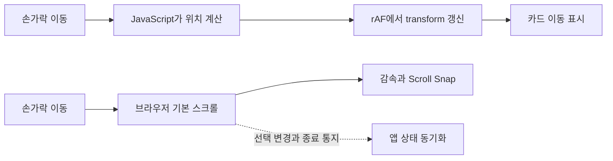

# iPhone 웹앱의 120fps 스크롤 구현 가이드

<!-- INTENT: 다른 앱을 개발하는 사람과 에이전트가 이 문서만 읽고 기본 스크롤을 적용하도록 한다. 이동을 브라우저에 맡기는 이유, 앱이 관리할 상태, 재발하기 쉬운 오류와 검증 기준을 함께 보존한다. 특정 기기에서의 체감이나 실행 결과를 일반적인 성능 보장으로 바꾸지 않는다. -->

iPhone에서 카드나 페이지를 부드럽게 넘기려면, **가로 이동을 브라우저 기본 스크롤로 만들고 CSS Scroll Snap으로 정렬합니다.** 손가락 추종과 감속은 브라우저가 처리하고, JavaScript는 선택한 카드와 앱의 상태를 동기화합니다.

목표는 ProMotion 디스플레이의 고주사율 스크롤 경로를 활용하는 것입니다. 웹페이지를 네이티브 앱으로 변환하거나 120fps로 고정하는 기법은 아닙니다. 디스플레이의 주사율, 브라우저가 내용을 갱신하는 주기, 실제 화면에 표시된 서로 다른 프레임 수를 구분합니다.

카드가 이어지는 배치와 현재 카드 및 양옆 카드의 내용을 준비하는 방법은 [가로 카드 UI와 렌더링 최적화 가이드](horizontal-card-ui-and-windowing.md)에서 다룹니다.

## 다른 앱에 적용할 때

이 문서를 읽을 수 있는 개발 에이전트에게 문서 링크와 대상 화면을 함께 전달합니다. 다음 요청문을 그대로 사용해도 됩니다.

> 이 문서를 읽고 대상 화면의 가로 카드 이동에 적용해 주세요. 현재 이동을 누가 처리하는지부터 확인하고, 기본 스크롤과 CSS Scroll Snap으로 전환해 주세요. 기존 디자인, 탭 동작, 세로 스크롤과 접근성을 유지하면서 이웃 카드가 실제로 이어져 움직이게 해 주세요. 매 프레임 JavaScript로 위치를 바꾸지 말고, 카드 선택과 이동 완료 상태를 분리해 주세요. 모바일 화면에서 터치 입력과 캡처로 검증하고, 확인한 동작과 실기기 성능 측정 여부를 구분해 보고해 주세요. 기본 스크롤로 구현하기 어려운 요구가 있다면 해당 요구와 이유를 먼저 설명해 주세요.

문서의 예제는 유한한 개수의 같은 너비 카드와 왼쪽에서 오른쪽으로 배치하는 레이아웃을 전제로 합니다. 가변 너비, RTL, 무한 순환에서는 좌표 계산과 경계 처리를 다시 설계합니다. 프레임워크와 디자인 값은 대상 앱에 맞추되, 이동을 담당하는 구조와 검증 기준은 유지합니다.

## 기본 스크롤을 선택할 기준

| 화면의 요구 | 권장 구현 | 판단 기준 |
| --- | --- | --- |
| 질문 카드, 사진, 온보딩 페이지 | 기본 가로 스크롤과 Scroll Snap | 나란히 놓인 항목을 손으로 넘기고 일정 위치에 정렬 |
| 연속으로 읽는 목록 | 기본 스크롤 | 중간 위치에서 멈추는 동작도 필요 |
| 카드 안의 긴 답변 | 별도의 기본 세로 스크롤 | 가로 카드 이동과 세로 읽기 동작의 공존 |
| 카드 뒤집기, 펼치기 | 별도 CSS 전환 등 | 카드 내부의 변화이며 가로 스크롤과 독립 |
| 자유로운 물리 시뮬레이션이나 지정된 이동 궤적 | 별도 애니메이션 설계 검토 | 기본 스크롤의 정렬 규칙으로 표현하기 어려운 요구 |

슬라이더 라이브러리는 내부 구현을 확인한 뒤 선택합니다. 라이브러리 이름이나 번들 크기보다, 이동을 기본 스크롤에 맡기는지 JavaScript가 매 프레임 `transform`을 갱신하는지가 이 문제의 판단 기준입니다. 기본 스크롤을 지원하는 라이브러리도 있으므로 라이브러리 사용 자체를 문제로 보지 않습니다.

## 세로 스크롤과 가로 애니메이션의 느낌이 달라지는 이유

페이지의 세로 이동은 기본 스크롤인데 가로 카드 이동은 JavaScript 애니메이션이면, 두 동작은 서로 다른 경로로 처리됩니다. 가로 이동을 최적화할 때는 감속 곡선보다 이 차이를 먼저 확인합니다.



WebKit은 iOS의 가속 스크롤을 지원하며, 스크롤을 흉내 내는 라이브러리 없이도 overflow 영역을 처리합니다. `-webkit-overflow-scrolling: touch`를 고주사율을 켜는 필수 설정으로 추가하지 않습니다. 과거 호환성 설정을 유지해야 한다면 대상 브라우저에서 필요한 이유를 확인합니다. [WebKit의 가속 스크롤 설명](https://webkit.org/blog/9674/new-webkit-features-in-safari-13/)

WebKit 개발자는 페이지 렌더링 갱신과 `requestAnimationFrame`이 ProMotion 디스플레이에서도 기본적으로 60Hz인 구성을 설명한 바 있습니다. 이는 모든 iOS 버전의 영구적인 제한을 뜻하지 않습니다. **기본 스크롤이 부드러워도 JavaScript 콜백은 더 낮은 주기로 관측될 수 있다**는 점이 설계에 중요합니다. [WebKit의 페이지 갱신 주기 설명](https://bugs.webkit.org/show_bug.cgi?id=290671#c4)

CSS Scroll Snap은 정렬 위치를 지정하고, 감속과 스냅의 구체적인 물리 동작은 브라우저에 맡깁니다. iPhone과 다른 플랫폼에서 완전히 같은 곡선을 강제하려는 요구와는 구분합니다. [CSS Scroll Snap 모델](https://www.w3.org/TR/css-scroll-snap-1/#model)

## 적용 순서

1. **이동을 제어하는 코드를 찾습니다.** `touchmove`, `pointermove`, `requestAnimationFrame`, `translateX`, `translate3d`, 슬라이더 라이브러리와 `touch-action`을 검색합니다. 카드 내부의 뒤집기나 시트 동작과 가로 이동 코드를 구분합니다.
2. **가로 이동의 제어를 브라우저로 옮깁니다.** 같은 영역에 기본 스크롤과 기존 드래그 엔진을 함께 두지 않습니다. 가로 이동용 위치 계산, 감속 루프, 트랙의 이동용 `transform`, 기본 스크롤을 막는 이벤트 처리를 제거합니다.
3. **카드를 실제 가로 공간에 배치합니다.** 현재 카드뿐 아니라 이웃 카드가 자기 위치와 크기를 갖도록 합니다. CSS Scroll Snap으로 정렬 지점을 선언합니다.
4. **앱 상태를 연결합니다.** 선택한 카드, 버튼의 목적지, 화면에 보이는 범위, 이동 완료를 구분합니다. 필터 변경, 재접속과 화면 회전에서도 같은 카드에 정렬되게 합니다.
5. **화면 밖의 비용을 줄입니다.** 무거운 카드 내용만 필요한 범위에 렌더링하고 스크롤 길이와 정렬 지점은 보존합니다.
6. **배포용 빌드에서 검증합니다.** 실제 터치 입력, 이동 중 화면과 정렬 후 화면을 확인합니다. 기능 검사와 실제 표시 프레임 측정은 별도로 기록합니다.

## 최소 구현 예제

### HTML과 CSS

아래 HTML과 CSS만으로 터치 스크롤과 카드 정렬이 동작합니다. 카드 내용과 색은 앱의 디자인으로 바꿉니다. 예제는 배치와 입력을 설명하며, 카드 뒤집기와 선택 상태는 이후 절의 규칙에 따라 연결합니다.

```html
<meta charset="utf-8">
<meta name="viewport" content="width=device-width, initial-scale=1, viewport-fit=cover">

<div class="deck" role="region" aria-label="카드 목록" tabindex="0">
  <div class="deck-track">
    <article class="slide">
      <h2>첫 번째 카드</h2>
      <div class="answer-scroll">길어지는 본문을 이 영역에 배치합니다.</div>
    </article>
    <article class="slide">
      <h2>두 번째 카드</h2>
      <div class="answer-scroll">각 카드의 내용은 독립적으로 유지합니다.</div>
    </article>
    <article class="slide">
      <h2>세 번째 카드</h2>
      <div class="answer-scroll">마지막 카드도 같은 여백에 정렬합니다.</div>
    </article>
  </div>
</div>
```

```css
.deck,
.deck * {
  box-sizing: border-box;
}

.deck {
  --inset-left: max(24px, env(safe-area-inset-left));
  --inset-right: max(24px, env(safe-area-inset-right));
  --card-gap: 32px;

  width: 100%;
  height: 65dvh;
  min-height: 280px;
  overflow-x: auto;
  overflow-y: hidden;
  scroll-padding-left: var(--inset-left);
  scroll-padding-right: var(--inset-right);
  scroll-snap-type: x mandatory;
  scroll-behavior: auto;
  touch-action: pan-x pan-y pinch-zoom;
  scrollbar-width: none;
}

.deck::-webkit-scrollbar {
  display: none;
}

.deck-track {
  display: flex;
  position: relative;
  height: 100%;
  padding-left: var(--inset-left);
  padding-right: var(--inset-right);
}

/* 고정 너비 트랙 밖으로 카드가 넘쳐도 마지막 카드 뒤의 공간을 유지한다. */
.deck-track::after {
  content: '';
  flex: 0 0 var(--inset-right);
}

.slide {
  position: relative;
  flex: 0 0 100%;
  min-width: 0;
  height: 100%;
  margin-right: var(--card-gap);
  padding: 24px;
  display: flex;
  flex-direction: column;
  scroll-snap-align: start;
  scroll-snap-stop: always;
}

.slide:last-child {
  margin-right: 0;
}

.answer-scroll {
  flex: 1;
  min-height: 0;
  overflow-y: auto;
}
```

트랙의 `padding`은 카드 너비와 시작 여백을 정하고, 뷰포트의 `scroll-padding`은 카드를 정렬할 위치를 지정합니다. 고정 너비 트랙 밖으로 카드가 넘칠 때는 오른쪽 padding만으로 끝 여백이 확보된다고 가정하지 않습니다. 예제는 `::after`로 마지막 카드 뒤의 공간도 확보합니다. 첫 카드와 마지막 카드가 같은 위치에 놓이는지 확인합니다.

앱 바깥 여백 때문에 이동 중인 카드가 너무 일찍 잘리면 스크롤 뷰포트를 화면 가장자리까지 넓히고 트랙 안에 여백을 둡니다.

스냅 대상인 `.slide`는 카드 내용의 배치 기준이 됩니다. 슬롯 전체에 `overflow: hidden`을 추가해 별도의 스크롤 컨테이너로 만들지 않고, 모서리나 본문을 잘라야 할 때는 안쪽 요소에서 처리합니다. 버튼 이동이 정렬되더라도 터치 후 정렬이 같은 경로로 동작하는지 따로 확인합니다.

`scroll-snap-stop: always`는 방향을 가진 스크롤에서 중간 정렬 지점을 지나치지 않도록 요청합니다. 절대 위치를 지정하는 `scrollTo()`까지 한 카드씩만 움직이게 제한하는 설정은 아닙니다. 빠른 플릭과 버튼 이동을 각각 확인합니다. [Scroll Snap 정지 규칙](https://www.w3.org/TR/css-scroll-snap-1/#scroll-snap-stop)

예제의 너비와 여백은 디자인 값입니다. 임의의 다른 레이아웃에 `flex: 0 0 100%`만 복사하면 기준 너비가 달라질 수 있으므로 뷰포트, 트랙과 카드의 실제 크기를 함께 확인합니다.

### 버튼은 같은 스크롤 영역을 이동

버튼이 별도의 애니메이션을 실행하지 않도록, 터치와 같은 영역에 `scrollTo()`를 요청합니다. 다음 예제는 위 HTML에 연결하는 목적지 이동 함수입니다.

```js
const deck = document.querySelector('.deck');
const slides = [...deck.querySelectorAll('.slide')];
const reducedMotion = matchMedia('(prefers-reduced-motion: reduce)');

function scrollToCard(index, animated = true) {
  if (slides.length === 0) return;
  const target = Math.max(0, Math.min(slides.length - 1, index));

  // 같은 offsetParent 안의 상대 위치로 좌우 여백의 영향을 없앤다.
  const left = slides[target].offsetLeft - slides[0].offsetLeft;
  deck.scrollTo({
    left,
    behavior: animated && !reducedMotion.matches ? 'smooth' : 'auto',
  });
}

// 버튼에서 scrollToCard(1)을 호출하면 두 번째 카드로 이동한다.
// 재접속 위치를 복원할 때는 scrollToCard(index, false)를 사용한다.
```

이 예제는 같은 너비, 같은 간격, LTR 배치와 `start` 정렬에서 사용합니다. 카드가 각각 다른 offsetParent에 속하거나 가운데 정렬, RTL을 사용하면 목적지 계산도 달라집니다. 제품에서는 초기 배치와 너비 변경 시 좌표를 캐시하고, 스크롤 이벤트마다 전체 카드의 크기를 다시 읽지 않습니다.

`smooth`의 시간과 곡선은 브라우저가 정합니다. 일정한 밀리초나 CSS `transition`으로 스크롤의 감속 곡선을 지정할 수 있다고 가정하지 않습니다. 이미 목적지에 있으면 새 종료 이벤트가 오지 않을 수 있으므로 상태를 바로 확정합니다. [CSSOM View의 스크롤 동작](https://drafts.csswg.org/cssom-view/#scrolling)

## 제품에 연결할 상태 설계

<!-- INTENT: 손가락 위치를 추적하던 슬라이더의 상태를 그대로 옮기면 앱이 기본 스크롤과 경쟁한다. 여기서는 위치 계산을 관찰과 목적지 요청으로 제한하고, 선택 변경과 화면 정리를 분리한다. -->

### 선택한 카드와 이동 완료를 분리

| 상태 | 역할 | 갱신 시점 |
| --- | --- | --- |
| 선택한 카드 | 질문 번호, 책갈피, 접근 가능한 카드 결정 | 가장 가까운 카드가 달라지거나 버튼으로 목적지를 지정할 때 |
| 버튼의 목적지 | 빠른 연속 입력의 기준 | 버튼 입력 시 설정, 직접 터치나 휠 입력 또는 이동 완료 시 해제 |
| 보이는 카드 범위 | 내용 렌더링과 미리 불러오기 | 화면에 들어오거나 나가는 카드가 달라질 때 |
| 이동 완료 | 화면 밖의 일시 상태 정리 | 기본 스크롤의 종료 통지 또는 제한된 보완 판정 |

같은 간격의 카드라면 캐시한 카드 간격으로 `round(scrollLeft / step)`을 계산해 가까운 카드를 구할 수 있습니다. 결과는 유효한 인덱스로 제한합니다. 상태 값이 같으면 React 등의 렌더링을 다시 요청하지 않습니다. 가변 너비라면 캐시한 정렬 위치들 중 가장 가까운 위치를 찾습니다.

빠른 버튼 입력은 현재 보이는 위치가 아니라 **직전 버튼의 목적지**를 기준으로 누적합니다. 이동 도중 다시 손으로 잡으면 목적지를 해제하고 실제 스크롤 위치를 따릅니다. 이 구분이 없으면 다음 버튼을 여러 번 눌러도 같은 카드로 향하거나, 지나가는 카드가 선택 상태를 되돌립니다.

나가는 카드가 답변을 보여 주고 있다면 화면에서 사라질 때까지 그 상태를 유지합니다. 선택한 인덱스가 바뀌었다는 이유로 즉시 앞면으로 되돌리면 이동 도중 내용이 바뀝니다. 새 카드의 활성화와 이전 카드의 정리는 서로 다른 시점에 수행합니다.

### 종료 이벤트와 보완 판정

`scrollend`를 주된 종료 신호로 사용합니다. 손가락을 뗀 시점에는 관성 이동이나 스냅이 남아 있을 수 있으므로 `touchend`를 이동 완료로 취급하지 않습니다. [CSSOM View의 스크롤 완료 정의](https://drafts.csswg.org/cssom-view/#scroll-completed)

대상 브라우저에서 종료 통지가 지원되지 않거나 일부 경로에서 오지 않으면 다음 조건을 함께 확인하는 보완 처리를 둡니다.

1. 마지막 스크롤 이벤트 뒤에 정한 대기 시간이 지났는지 확인합니다.
2. 실제 `scrollLeft`가 가장 가까운 스냅 위치에 충분히 가까운지 확인합니다.
3. 버튼의 목적지가 남아 있다면 그 목적지에 도달했는지 확인합니다.
4. 조건을 만족하면 선택과 이동 상태만 정리합니다.

대기 시간과 좌표 허용 오차는 환경에 맞춰 검증할 조정값입니다. 타이머만으로 브라우저의 물리 동작이 끝났다고 단정하지 않습니다. 보완 처리에서 `scrollLeft`를 계속 덮어쓰거나 스프링 애니메이션을 시작하면 기본 스크롤과 다시 경쟁하게 됩니다. 이 경로에서는 실제 드래그 대상의 DOM을 제거하는 등 입력을 끊는 정리도 피합니다.

### 화면 크기와 데이터 변경

`ResizeObserver`로 스크롤 영역의 너비를 확인하고, 너비가 달라지면 좌표를 다시 측정한 뒤 현재 카드에 즉시 정렬합니다. 주소창 때문에 높이만 바뀌는 상황에서는 가로 위치를 다시 지정하지 않습니다.

필터 변경이나 새 회차처럼 카드 배열이 바뀌면 좌표 캐시와 관찰 대상을 갱신합니다. React에서 전체 회차를 다시 마운트하는 방법도 사용할 수 있습니다. 항목의 ID는 렌더링 중 유지하고, 콘텐츠가 비동기로 도착해도 바깥 카드의 너비와 정렬 지점을 바꾸지 않습니다. 컴포넌트를 해제할 때 이벤트 리스너, 타이머와 Observer를 정리합니다.

## 기본 스크롤을 유지하면서 렌더링 비용 줄이기

가로 공간과 무거운 콘텐츠를 분리합니다. 바깥 슬롯은 각 카드의 크기와 스냅 위치를 유지하고, 안쪽의 긴 답변, 마크다운과 3D 면은 화면에 보이는 카드와 이웃에만 만듭니다.

`IntersectionObserver`는 보이는 카드 범위를 갱신하는 데 사용합니다. 화면에 들어온 뒤에야 내용을 만들면 빈 카드가 먼저 보일 수 있으므로 이웃도 미리 준비합니다. 버튼 연속 입력으로 먼 목적지까지 이동한다면 현재 위치와 목적지 사이에 지나갈 내용도 준비합니다. 매우 큰 목록에서 슬롯까지 가상화하려면 제거한 영역의 너비와 정렬 좌표를 보존하는 별도 설계가 필요합니다.

스크롤 중에는 다음 작업을 피합니다.

- 매 프레임 카드 위치나 `scrollLeft`를 React 상태로 저장하는 작업
- 전체 카드의 `getBoundingClientRect()`를 반복해 읽은 뒤 스타일을 다시 쓰는 작업
- 화면 밖의 모든 카드에 3D 면과 복잡한 답변을 미리 만드는 작업
- 카드 전체에 `will-change`나 `translateZ(0)`를 일괄 적용하는 작업
- 스크롤 이벤트마다 마크다운을 파싱하거나 학습 기록을 저장하는 작업

`transform`과 합성 레이어 자체가 나쁜 것은 아닙니다. 레이어는 다시 그리는 비용을 줄이는 대신 메모리를 사용합니다. 필요한 범위를 측정해서 적용하며, 가로 스크롤과 독립적인 카드 뒤집기 효과는 유지할 수 있습니다. [WebKit Layers의 비용과 진단 방법](https://webkit.org/web-inspector/layers-tab/)

## 터치, 세로 스크롤과 접근성

기본 스크롤 영역에서는 가로 이동용 `preventDefault()`와 `touch-action: none`을 제거합니다. 기존 드래그 구현의 `touch-action: pan-y`가 남으면 브라우저의 가로 터치 처리가 막힐 수 있습니다. 이벤트를 관찰하기만 하는 터치와 휠 리스너에는 `{ passive: true }`를 사용합니다. `passive`는 무거운 콜백을 가볍게 만들어 주는 설정은 아닙니다.

카드 안의 답변에는 별도의 `overflow-y: auto` 영역을 두고, Flexbox 안에서는 필요한 조상과 내용 영역에 `min-height: 0`을 적용합니다. 답변 위에서 세로로 읽기와 가로로 카드 넘기기를 모두 확인합니다. `touch-action`은 터치 대상과 관련 조상들의 영향을 받으므로 바깥 뷰포트만 고쳐서는 충분하지 않을 수 있습니다. [Pointer Events의 터치 동작 판정](https://www.w3.org/TR/pointerevents3/#determining-supported-direct-manipulation-behavior)

스와이프 인식용 투명 레이어를 카드 전체에 덮지 않습니다. 탭, 체크박스, 링크와 텍스트 선택을 실제 콘텐츠가 받도록 합니다. 스크롤 뒤에 의도하지 않은 탭이 발생하는지는 실제 입력으로 검사하고, 확인 없이 전체 클릭을 막는 시간 제한을 추가하지 않습니다.

좌우 이동 버튼은 스와이프의 대체 수단으로 남깁니다. 화면 밖 카드와 뒤집힌 반대 면의 포커스 정책을 정하고, 스크린리더가 보이지 않는 답변을 읽지 않도록 합니다. 필요하면 `inert`와 `aria-hidden`을 사용하되 포커스가 있는 요소를 그대로 숨기지 않습니다. 카드 선택을 따라 포커스를 옮길 때는 `focus({ preventScroll: true })`로 의도하지 않은 추가 스크롤을 막습니다.

`prefers-reduced-motion`을 존중해 버튼 이동과 카드 뒤집기의 장식적 모션을 줄입니다. 핀치 확대와 화면 가장자리의 시스템 제스처를 별도 구현으로 대체하지 않습니다. 마우스 왼쪽 버튼 드래그는 기본 overflow 스크롤이 자동으로 제공하는 기능이 아니므로 PC에서는 버튼, 키보드와 트랙패드 동작을 확인합니다.

## 120fps 검증과 진단

### 수치가 가리키는 대상부터 확인

| 관찰값 | 확인하는 것 | 이것만으로 확정하지 않는 것 |
| --- | --- | --- |
| `requestAnimationFrame` 간격 | JavaScript 콜백이 호출되는 주기 | 기본 스크롤의 표시 fps |
| `scroll` 이벤트 간격 | 앱이 스크롤 변경 통지를 받는 주기 | 디스플레이 갱신 횟수 |
| Web Inspector의 JS, Layout, Paint | 페이지가 CPU와 렌더링 시간을 쓰는 위치 | 물리 화면에 표시된 전체 프레임 수 |
| 정지 캡처 | 카드의 배치, 잘림과 이웃 카드 존재 | 움직임의 프레임률 |
| 실제 기기에서의 체감 | 지연, 끊김과 조작감의 개선 | 정확히 120fps를 유지했다는 측정 |
| 표시 프레임을 구분할 수 있는 기기 계측이나 고속 촬영 | 측정 조건에서의 실제 표시 변화 | 다른 기기와 전원 상태에서도 같은 성능 |

120fps의 프레임 간격은 약 8.33ms, 60fps는 약 16.67ms입니다. 짧은 이벤트 간격 하나를 역수로 바꿔 화면 fps라고 표시하지 않습니다. JavaScript 진단기를 만든다면 충분한 구간의 `콜백 수 / 경과 시간`과 간격의 p95를 표시하고, 측정 구간과 표본 수를 함께 관리합니다. 탭이 백그라운드로 갔다 돌아오면 표본을 초기화합니다.

진단기는 필요할 때만 켭니다. 오버레이를 매 프레임 갱신하는 행위도 부하이므로 일반 사용 화면에서는 진단 루프를 실행하지 않습니다. JavaScript 콜백이 60Hz라고 해서 기본 스크롤도 60fps라고 판정하거나, 그 숫자를 올리려고 진단기를 수정하지 않습니다.

### 실기기 비교 절차

1. 배포용 빌드를 사용합니다. 같은 iPhone과 같은 브라우저에서 변경 전후를 비교합니다.
2. ProMotion 지원 여부, OS와 브라우저 버전, 저전력 모드와 프레임률 제한 설정을 기록합니다. 비교 중에는 조건을 유지합니다.
3. 진단 오버레이를 끈 상태에서 느린 드래그, 빠른 플릭, 이동 중 반대 방향 입력을 반복합니다. 같은 화면의 기본 세로 스크롤과도 비교합니다.
4. 질문과 답변 화면에서 각각 조작합니다. 긴 답변, 코드 블록과 이미지처럼 비용이 큰 내용도 포함합니다.
5. Mac을 사용할 수 있으면 연결한 iPhone을 Safari Web Inspector로 조사합니다. JS 실행, Layout, Paint와 레이어 비용이 커지는 구간을 찾습니다. 계측 도구를 연결한 상태와 해제한 상태도 비교합니다.
6. 정확한 표시 fps가 필요하면 해당 지표를 측정하는 도구나 충분한 시간 해상도의 외부 촬영을 사용합니다. 촬영의 노출, 화면 주사와 중복 프레임 영향을 구분합니다. 측정하지 않았다면 조작감 개선까지만 보고합니다.

ProMotion 기기의 프레임률 제한 설정은 최대 표시 프레임률을 60fps로 제한합니다. 저전력 모드도 디스플레이 동작에 영향을 줄 수 있으므로 비교 조건에 포함합니다. 이러한 설정을 앱의 성능 문제를 숨기는 수단으로 사용하지 않습니다. [Apple의 동작 설정 안내](https://support.apple.com/guide/iphone/customize-onscreen-motion-iph0b691d3ed/ios), [Apple의 저전력 모드 안내](https://support.apple.com/en-us/101604)

Web Inspector에서는 JavaScript와 렌더링 작업의 비용을 조사합니다. Frames 보기의 수치를 실제 패널의 주사율과 동일한 지표로 취급하지 않습니다. 계측 기능 자체의 비용도 고려합니다. [WebKit Timelines 안내](https://webkit.org/web-inspector/timelines-tab/)

### 자동 검사와 캡처

자동화는 카드의 위치와 상태를 검증하는 데 사용합니다. 테스트 코드가 `scrollLeft`를 직접 바꾼 검사만으로 손가락 제스처를 검증했다고 보고하지 않습니다. 도구가 지원하는 실제 입력 경로를 사용하고, 지원하지 않는 모바일 제스처는 실기기 검사로 남깁니다. 모바일 화면 크기의 데스크톱 WebKit 실행도 실제 iPhone의 표시 성능을 증명하지는 않습니다.

| 검사 | 통과 기준 |
| --- | --- |
| 드래그 중간 캡처 | 나가는 카드와 들어오는 카드가 실제 위치에 함께 존재하며 간격 유지 |
| 손가락을 뗀 뒤 | 카드가 정렬 위치에 도달하고 선택 상태와 일치 |
| 빠른 연속 입력과 반대 입력 | 목적지 누락, 선택 상태 되돌림과 빈 카드 없음 |
| 첫 카드와 마지막 카드 | 잘못된 인덱스나 비어 있는 추가 페이지 없음 |
| 답변을 연 상태에서 이동 | 나가는 답변이 화면 밖으로 나갈 때까지 유지 |
| 답변의 세로 스크롤 | 카드 선택과 뒤집기 상태 유지 |
| 탭과 내부 버튼 | 스와이프 뒤 오작동 없이 답변, 체크박스와 링크 작동 |
| 화면 회전과 재접속 | 같은 카드의 정상 정렬과 복원 |
| 주소창으로 인한 높이 변화 | 진행 중인 가로 스크롤을 불필요하게 초기화하지 않음 |
| 필터 변경과 새 회차 | 카드 목록, 좌표 캐시와 선택 상태의 일치 |
| 동작 줄이기와 키보드 | 장식적 모션 감소와 대체 조작 유지 |
| 종료 통지가 없는 환경 | 이동 중 상태가 영구히 남지 않음 |

캡처는 정지 화면뿐 아니라 드래그 중간과 정렬 후 화면을 나눠 남깁니다. 캡처를 검사할 때는 질문의 가독성, 이웃 카드의 연결, 좌우 여백과 카드 내부의 잘림을 확인합니다.

## 증상별 점검 순서

| 증상 | 먼저 확인할 것 | 수정 방향 |
| --- | --- | --- |
| 세로는 부드럽고 가로만 덜 부드러움 | 가로 위치를 JS가 매 프레임 갱신하는지 | 기본 스크롤로 이동 제어 이전 |
| 기본 스크롤인데 손가락이 먹지 않음 | `touch-action`, 이벤트 취소, 입력을 가로채는 레이어 | 기본 입력 허용 |
| 정렬된 카드의 좌우 위치가 어긋남 | 실제 padding, scroll-padding, 카드 너비와 마지막 여백 | 배치 기준과 목적지 계산 일치 |
| 빠르게 넘기면 빈 화면 노출 | 화면 진입 후에야 콘텐츠를 만드는지 | 이웃과 이동 경로의 내용 준비 |
| 카드 내용이 이동 도중 바뀜 | 선택 변경 때 나가는 카드 상태를 지우는지 | 화면에서 사라진 뒤 상태 정리 |
| 번호나 책갈피가 다른 카드를 가리킴 | 관측 위치와 버튼 목적지를 혼용하는지 | 선택, 목적지와 이동 완료 분리 |
| 이동 중 상태가 풀리지 않음 | 종료 이벤트 누락과 취소 경로 | 실제 정렬 여부를 확인하는 보완 판정 |
| 화면 회전이나 주소창 변화 때 튐 | 높이 변화에도 가로 복원을 실행하는지 | 너비 변화에 한정해 재측정 |
| 카드가 많아질수록 끊김 | DOM, 레이어, 이미지와 마크다운 비용 | 스크롤 공간을 보존하며 내용 렌더링 제한 |
| 진단은 60Hz인데 조작감은 개선됨 | 그 숫자가 JS 콜백 주기인지 | 표시 fps와 별도 지표로 보고 |

이징 곡선, GPU 관련 CSS와 라이브러리 교체부터 반복하지 않습니다. **누가 이동을 제어하는지, 필요한 내용이 제때 준비되는지, 실제로 무엇을 측정했는지**를 순서대로 확인합니다.

## 적용 완료 기준

완료 보고에는 이동 구조, 보존한 사용자 동작, 입력 검사와 캡처 결과, 실기기에서 측정한 범위를 적습니다. "기본 스크롤로 전환", "실기기 조작감 개선 확인", "표시 프레임 계측"을 서로 다른 확인 항목으로 다룹니다.

프로젝트에는 가로 이동을 브라우저에 맡긴 이유를 해당 컴포넌트 바로 앞에 짧게 남깁니다. 그래야 다음 수정에서 익숙한 드래그 라이브러리나 rAF 루프로 되돌아가지 않습니다. 예제와 별개로 실제 상태 연결을 살펴보려면 [연습앱의 스크롤 컴포넌트](../src/CardCarousel.tsx)와 [앱 통합 코드](../src/App.tsx)를 참고합니다. 이 문서의 절차는 해당 앱에 의존하지 않습니다.
